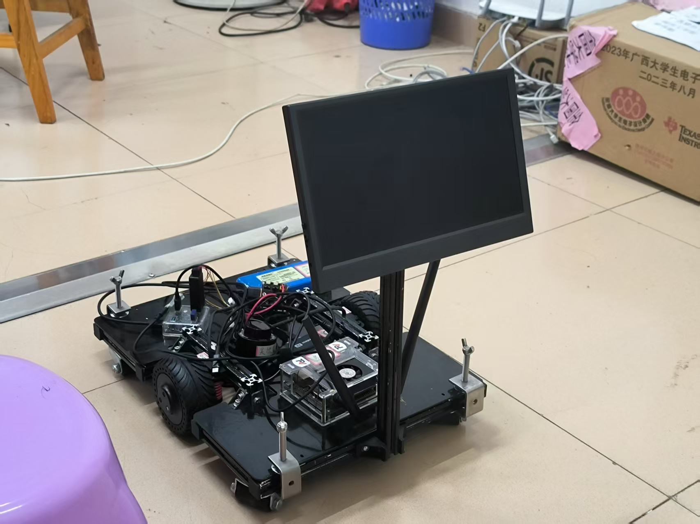

<div align="center">

# 🤖 Smart Warehouse AGV Chassis

**A two-wheel differential-drive warehouse AGV built on NVIDIA Jetson Xavier NX and ROS 2**

[](./LICENSE)


[简体中文](./README_zh.md) | English

</div>

---

<div align="center">

<br/>
<em>Final full view of the completed AGV</em>
</div>

---

## About This Project

This is a smart warehouse AGV chassis I designed, built and tuned end-to-end myself. It runs on an **NVIDIA Jetson Xavier NX** with a full **ROS 2 Foxy** autonomy stack: **Cartographer** for real-time mapping, **Nav2** for localization and path planning, and a **LeiShen N10P TOF LiDAR** for environment perception.

For the drivetrain I made a different choice — **no intermediate MCU**: the Jetson talks directly to two **Waveshare DDSM115 servo hub motors** (built-in FOC drivers + 4096-line encoders) over USB-to-RS485, which keeps control latency low and odometry accurate. The vehicle also carries a **Seeed reCamera edge AI camera** (YOLO11n + Node-RED) as a mobile security sentinel with person-detection auto-capture, plus a **Web HMI dispatch terminal** — a single browser page for teleop, status monitoring, RViz2 via noVNC, and security alerts.

## Highlights

- **MCU-less drivetrain**: Jetson ↔ DDSM115 built-in FOC drivers over RS485 (left wheel ID=1, right wheel ID=2, 115200 bps velocity loop) — no STM32 middle layer, low latency, accurate odometry.
- **Isolated compute pools**: navigation decisions run on the Jetson NX; security vision runs on the reCamera's 1-TOPS NPU. They never contend for resources.
- **Dual power rails**: a 12V/9000mAh pack powers the Jetson; a 100W PD power bank triggered to 15V (CH224K) feeds the motors through a distribution board — surge coupling eliminated.
- **Two frontend channels**: rosbridge WebSocket for lightweight commands/status, noVNC-embedded RViz2 for heavy rendering.

## Architecture

```
                        ┌────────────────────────────────────────────┐
                        │      Web Browser (frontend/index.html)     │
                        │  Teleop / Status / noVNC Monitor / Alerts  │
                        └──────┬──────────────┬──────────────┬───────┘
                       ws:9090 │       http:6080│        ws:8090│ + REST API
              (rosbridge)      │       (noVNC)  │      (video stream/capture)
┌─────────────┴────────────────▼───┐          │
│  Jetson Xavier NX (8GB)          │          │
│  Ubuntu 20.04 + ROS 2 Foxy (DDS) │          │
│  ┌──────────┐ ┌───────────────┐  │          │
│  │ agv_slam │ │ lslidar_driver │  │          │
│  │Cartographer│ │  N10P driver │  │          │
│  └──────────┘ └───────▲───────┘  │          │
│  ┌────────────────────┴───────┐  │          │
│  │ Nav2 (AMCL/costmaps/planner)│  │          │
│  └────────────▲───────────────┘  │          │
│  ┌────────────┴───────────────┐  │  x11vnc+noVNC (RViz2 desktop)
│  │ agv_base_control           │  │          │
│  │ base_node.py  /web_cmd sub │  │          │
│  └──────┬──────────────▲──────┘  │          │
└─────────│RS485(USB-RS485)│USB(TTL)└──────────┘
          ▼              │
┌──────────────────┐ ┌───┴─────────────┐   ┌─────────────────────────┐
│ DDSM115 hub motor│ │ LeiShen N10P    │   │ reCamera (SG2002, 1TOPS) │
│ FOC+encoder built│ │ TOF/360°/25m    │   │ YOLO11n + Node-RED       │
│ L=ID1      R=ID2 │ │ 460800bps serial│   │ USB RNDIS 192.168.42.1   │
└──────────────────┘ └─────────────────┘   └─────────────────────────┘
   15V PD power bank        5V USB               5V USB
  (drive/logic dual power isolation)
```

## Mapping Result


This is the 4th-iteration map I built with Cartographer in my own environment — the same one the navigation demo loads by default. You can reuse it to validate the Nav2 pipeline, or build your own following the Quick Start below.

## Bill of Materials (BOM)

| # | Part | Model / Spec | Qty | Interface / Connection | Notes |
|---|---|---|---|---|---|
| 1 | Main controller | NVIDIA Jetson Xavier NX 8GB (dev kit P3518, carrier board P3509-A01) | 1 | — | 6-core Carmel ARMv8.2 + 384 Volta CUDA cores, 21 TOPS (INT8), 8GB LPDDR4x |
| 2 | LiDAR | LeiShen N10P (LSN10P) TOF single-line LiDAR | 1 | HY2.0-6P cable → official serial-to-USB adapter (CH343, Type-C) → NX J6 upper port (/dev/ttyACM1) | 360° scan, 25 m range, ±3 cm accuracy, 5400 samples/s, 6–12 Hz, 460800 bps serial, 60 kLux ambient-light immunity |
| 3 | Serial-to-USB adapter | Official LiDAR accessory, built-in CH343 (USB-to-TTL) | 1 | Type-C, 5V/500mA from NX USB; also powers the LiDAR | LiDAR draws 1–1.8W (5V/200–360mA), no extra regulator needed |
| 4 | Drive motors | Waveshare DDSM115 integrated servo hub motors (out-runner PMSM, built-in FOC driver + 4096-line/rev encoder) | 2 (left ID=1, right ID=2) | Signal: ZH1.5×4P (RS485 A/B/GND, daisy-chained); Power: XH2.54×2P (VCC/GND) | Rated 115 rpm / 0.96 Nm / 18V (12–24V) / 1.25A; stall 2.0 Nm (≤2.7A); 10 kg per wheel, ~20 kg vehicle |
| 5 | USB-to-RS485 module | Industrial grade: CH343G (USB→UART) + SP485EEN (TTL→RS485) | 1 | NX J7 upper USB 3.1; A/B/GND to the motor bus | 115200 bps, master–slave protocol, 10-byte frames, velocity mode (0x02) |
| 6 | Edge AI camera | Seeed Studio reCamera 2002w (SOPHGO SG2002, RISC-V, 1-TOPS NPU) | 1 | Shielded USB A↔C cable: B1_STD OTG port → NX J6 lower port; RNDIS NIC at 192.168.42.1 | Modular: C1_2002w core board + S1_GC2053 5MP sensor board + B1_STD base board; 256MB DDR3, 64GB eMMC, 2.4G/5G WiFi + BT, 40×40×45.8mm, 5V/1A; runs YOLO11n + Node-RED on-device |
| 7 | Main battery | 12V 3S1P 9000mAh Li-po pack | 1 | DC 5.5×2.1mm female (center-positive) → NX J16 DC jack (9–20V input) | 11.1V nominal / 12.6V full / 9.0V cutoff, 10A continuous, PCM protection, ≥500 cycles; NX loads 10–15W (~1.5A @12V) |
| 8 | Drive battery | 100W PD power bank | 1 | PD-triggered 15V output | Dedicated motor supply, fully isolated from logic power |
| 9 | PD trigger cable | CH224K-based "PD-to-XT60" cable (CFG pin resistor selects 15V) | 1 | Power-bank Type-C → XT60 male | CH224K supports PD3.0/2.0, BC1.2, QC; ESSOP10; built-in OVP/OTP |
| 10 | Power distribution board | DJI RoboMaster Power Distributor 2 | 1 | 1× XT60 input (30A rated) → 2× XT30 outputs (15A each) to left/right motors | 41×41×14mm |
| 11 | XT30 leads | Amass XT30 male cables (keyed, red+/black−) | 2 | Distributor XT30 → motor XH2.54×2P power port | 15V drive rail |

> Chassis structural parts (frame, casters, fasteners) and purchase links to be added. Full carrier-board pinout and electrical details: [hardware/BOM.md](hardware/BOM.md).

### Power Architecture

- **Logic rail**: 12V/9000mAh pack → DC jack → Jetson NX (dedicated supply, immune to motor surges)
- **Drive rail**: 100W PD power bank → CH224K trigger to 15V → XT60 → RoboMaster distribution board → 2× XT30 (15A) → DDSM115 motors (18V rated, 12–24V operating range, 15V works fine)
- The two rails are physically isolated, eliminating motor surge coupling into the control system

## Directory Layout

| Path | Contents |
|---|---|
| `ros2_ws/src/agv_base_control/` | Chassis driver package (Python): `base_node.py` serial RS485 motor protocol (/dev/ttyACM0); `web_backend.py` subscribes to `/web_cmd` to bring up mapping/navigation |
| `ros2_ws/src/agv_slam/` | Cartographer 2D mapping package: launch + `cartographer_2d.lua` + historical maps |
| `ros2_ws/src/lslidar_driver/` | Official LeiShen LiDAR ROS 2 driver (this project uses `lsn10p_launch.py`, /dev/ttyACM1) |
| `ros2_ws/src/lslidar_msgs/` | LiDAR custom messages (LslidarPacket/Scan/Sweep/Point/Difop) |
| `frontend/index.html` | Web HMI dispatch terminal single-page app (rosbridge + noVNC + security monitoring) |
| `nodered/` | Node-RED flows (device-exported `flows.json`: SSCMA inference + person-detection capture trigger + 3 HTTP APIs, see its README) |
| `hardware/BOM.md` | Bill of materials and key electrical parameters (incl. carrier-board pinout) |
| `docs/operation-manual.md` | Operation manual: mapping / navigation / final one-click startup — every terminal command |
| `docs/maps/` | Historical map files (yaml + pgm/png, v1–v4) |
| `docs/images/` | Photos of the finished robot |
| `scripts/` | Convenience launch scripts (mapping / navigation) |

## Requirements

- **Main controller**: NVIDIA Jetson Xavier NX 8GB (JetPack 5.x / L4T)
- **OS**: Ubuntu 20.04 (Focal) + **ROS 2 Foxy Fitzroy**
- **apt packages**:
  ```bash
  sudo apt install -y python3-pip python3-colcon-common-extensions \
    ros-foxy-cartographer ros-foxy-cartographer-ros \
    ros-foxy-navigation2 ros-foxy-nav2-bringup \
    ros-foxy-teleop-twist-keyboard \
    ros-foxy-rosbridge-suite \
    x11vnc novnc
  ```
- **Python**: `pip3 install pyserial crcmod` (chassis serial protocol)
- **Edge vision** (optional): Seeed reCamera (SG2002) with built-in YOLO11n + Node-RED, USB RNDIS direct connection

## Quick Start

```bash
# 1. Place the workspace and build
mkdir -p ~/agv_ws && cp -r ros2_ws/src ~/agv_ws/
cd ~/agv_ws
colcon build
source install/setup.bash

# 2. Mapping (multi-terminal, full details in docs/operation-manual.md)
sudo chmod 777 /dev/ttyACM0 /dev/ttyACM1
ros2 run agv_base_control base_node          # Terminal 1: chassis
ros2 launch lslidar_driver lsn10p_launch.py  # Terminal 2: LiDAR
ros2 run tf2_ros static_transform_publisher 0 0 0.2 0 0 0 base_link laser  # Terminal 3: TF
ros2 launch agv_slam cartographer.launch.py  # Terminal 4: mapping
ros2 run teleop_twist_keyboard teleop_twist_keyboard  # Terminal 5: teleop
# Save the map: ros2 run nav2_map_server map_saver_cli -f my_map --fmt png

# 3. Navigation
ros2 launch nav2_bringup bringup_launch.py use_sim_time:=False \
  map:=$HOME/agv_ws/src/agv_slam/config/my_room_map_v4.yaml

# 4. Web HMI (optional)
ros2 launch rosbridge_server rosbridge_websocket_launch.xml
# Open frontend/index.html in a browser; set the IP field to your NX address
```

`scripts/mapping.sh` / `scripts/navigation.sh` wrap the multi-process startup (see script comments).

## Notes

- The default AGV IP `192.168.1.100` in `frontend/index.html` is an example address — change it in the page to your own device IP; `192.168.42.1` is the reCamera's factory-default USB RNDIS address.
- `x11vnc -nopw` and `chmod 777 /dev/ttyACM*` in the scripts are isolated-LAN debug steps; before deploying to a non-isolated network, set a VNC password and manage serial permissions via udev rules instead of chmod.
- `ros2_ws/src/lslidar_driver` and `lslidar_msgs` are LeiShen's official driver sources, © their original authors, included verbatim for build reproducibility.
- Nav2 runs with **stock `nav2_bringup` default parameters** (no custom AMCL/costmap/DWB YAML in this repo); the tuning described in the accompanying thesis was done experimentally on the robot and is not persisted here.
- `base_node` accepts ROS parameters: `serial_port` (default `/dev/ttyACM0`), `baudrate`, `wheel_radius` (default `0.0575` m for the 115 mm DDSM115 wheel), `wheel_base`, `cmd_vel_timeout` (default `0.5` s — auto brake when no new `cmd_vel` arrives; set `0` to disable). `web_backend` accepts `map_file` (default matches `scripts/navigation.sh`, i.e. `my_room_map_v4.yaml`).

## License

[MIT](./LICENSE) © 2026 xr686
