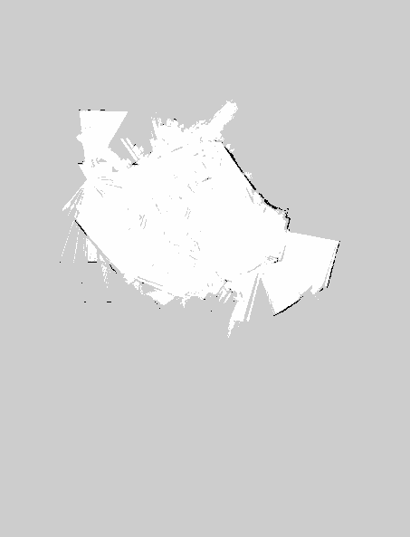

<div align="center">

# 🤖 智能仓储 AGV 底盘

**基于 NVIDIA Jetson Xavier NX 与 ROS 2 的两轮差速智能仓储 AGV**

[](./LICENSE)


简体中文 | [English](./README_EN.md)

</div>

---

## 关于这个项目

这是我独立设计、搭建并调试完成的一台智能仓储 AGV 底盘。它以 **NVIDIA Jetson Xavier NX** 为主控，在 **ROS 2 Foxy** 上跑通完整的自主导航链路：**Cartographer** 实时建图、**Nav2** 定位与路径规划、**镭神 N10P 激光雷达**感知环境。

驱动上我做了一个不一样的选择——**去掉单片机中间层**：主控通过 USB 转 RS485 直接对话两只**微雪 DDSM115 伺服轮毂电机**（内置 FOC 驱动器与 4096 线编码器），闭环延迟低、里程计准确。整车还搭载 **Seeed reCamera 边缘 AI 相机**（YOLO11n + Node-RED）作为移动安防哨兵，人形检测自动抓拍；再配一套 **Web HMI 调度终端**，浏览器单页即可完成遥控、状态监控、noVNC 查看 RViz2 画面与安防告警。

## 亮点

- **去单片机化**：主控 ↔ DDSM115 内置 FOC 驱动器 RS485 直连（左轮 ID=1 / 右轮 ID=2，115200 bps 速度环），没有 STM32 中间层，闭环延迟低、里程计准确。
- **算力分池**：导航决策跑在 Jetson NX 上，安防视觉跑在 reCamera 的 NPU（1 TOPS）上，物理隔离、互不抢占。
- **双电源架构**：12V/9000mAh 锂电专供主控；100W PD 充电宝经 CH224K 诱骗出 15V、过分电板专供电机，斩断浪涌干扰。
- **前端双通道**：rosbridge WebSocket 承载轻量指令/状态，noVNC 无损嵌入 RViz2 重渲染画面。

## 系统架构

```
                        ┌────────────────────────────────────────────┐
                        │        Web 浏览器（frontend/index.html）    │
                        │  遥控指令 / 状态显示 / noVNC 监控 / 安防告警 │
                        └──────┬──────────────┬──────────────┬───────┘
                       ws:9090 │       http:6080│        ws:8090│ + REST API
              (rosbridge)      │       (noVNC)  │      (视频流/抓拍库)
┌─────────────┴────────────────▼───┐          │
│  Jetson Xavier NX 主控 (8GB)      │          │
│  Ubuntu 20.04 + ROS 2 Foxy (DDS) │          │
│  ┌──────────┐ ┌───────────────┐  │          │
│  │ agv_slam │ │ lslidar_driver │  │          │
│  │Cartographer│ │  N10P 驱动    │  │          │
│  └──────────┘ └───────▲───────┘  │          │
│  ┌────────────────────┴───────┐  │          │
│  │ Nav2 (AMCL/代价地图/规划)   │  │          │
│  └────────────▲───────────────┘  │          │
│  ┌────────────┴───────────────┐  │  x11vnc+noVNC(RViz2 桌面推流)
│  │ agv_base_control           │  │          │
│  │ base_node.py  /web_cmd 订阅 │  │          │
│  └──────┬──────────────▲──────┘  │          │
└─────────│RS485(USB转485)│USB(TTL) └──────────┘
          ▼              │
┌──────────────────┐ ┌───┴─────────────┐   ┌─────────────────────────┐
│ DDSM115 轮毂电机×2│ │ 镭神 N10P 雷达   │   │ reCamera (SG2002, 1TOPS) │
│ FOC 驱动+编码器内置│ │ TOF/360°/25m     │   │ YOLO11n + Node-RED       │
│ 左轮ID=1 右轮ID=2 │ │ 460800bps 串口   │   │ USB RNDIS 192.168.42.1   │
└──────────────────┘ └─────────────────┘   └─────────────────────────┘
   15V PD充电宝分电         5V USB 供电            5V USB 供电
  （动力/弱电双电源隔离）
```

## 建图成果



这是我在自己环境里用 Cartographer 建出的第 4 版地图，也是导航演示默认加载的那张。你可以直接复用它跑 Nav2 验证流程，也可以按下面的「快速开始」建你自己的图。

## 硬件清单（BOM）

| # | 部件 | 型号/规格 | 数量 | 接口/连接方式 | 备注 |
|---|---|---|---|---|---|
| 1 | 主控 | NVIDIA Jetson Xavier NX 8GB（开发套件 P3518，载板 P3509-A01） | 1 | — | 6 核 Carmel ARMv8.2 + 384 CUDA 核（Volta），21 TOPS(INT8)，8GB LPDDR4x |
| 2 | 激光雷达 | 镭神智能 N10P（LSN10P）TOF 单线雷达 | 1 | HY2.0-6P 排线 → 官方串口转 USB 适配板（CH343，Type-C）→ NX J6 上端口（/dev/ttyACM1） | 360° 扫描，测距 25m，精度 ±3cm，采样 5400 次/s，扫描 6–12Hz，串口 460800bps，抗 60KLux 强光 |
| 3 | 串口转 USB 适配板 | 雷达官方配套，内置 CH343（USB 转 TTL） | 1 | Type-C，5V/500mA 取自 NX USB，同时给雷达供电 | 雷达功耗 1–1.8W（5V/200–360mA），无需额外降压 |
| 4 | 驱动电机 | 微雪 DDSM115 一体化伺服轮毂电机（外转子 PMSM，内置 FOC 驱动器 + 4096 线/转编码器） | 2（左轮 ID=1，右轮 ID=2） | 信号：ZH1.5×4P（RS485 A/B/GND，手拉手并联）；电源：XH2.54×2P（VCC/GND） | 额定 115rpm / 0.96Nm / 18V(12–24V) / 1.25A，堵转 2.0Nm（≤2.7A），单轮载重 10kg，两轮差速整车约 20kg |
| 5 | USB 转 RS485 模块 | 工业级，CH343G（USB→UART）+ SP485EEN（TTL→RS485）方案 | 1 | NX J7 上端口 USB 3.1；引出 A/B/GND 三线接电机总线 | 波特率 115200bps，主从式协议，10 字节帧，速度环模式(0x02) |
| 6 | 边缘视觉 AI 相机 | Seeed Studio reCamera 2002w（SOPHGO SG2002，RISC-V，1 TOPS NPU） | 1 | USB Type-A↔C 屏蔽线：底板 B1_STD OTG 口 → NX J6 下端口；RNDIS 虚拟网卡 192.168.42.1 | 模块化：核心板 C1_2002w + GC2053 5MP 传感器板 S1_GC2053 + 标准底板 B1_STD；256MB DDR3、eMMC 64GB、2.4G/5G WiFi + BT、40×40×45.8mm、5V/1A 供电；本地跑 YOLO11n + Node-RED |
| 7 | 主控电池 | 12V 聚合物锂电池组 3S1P，9000mAh | 1 | DC 5.5×2.1mm 母座（中心正极）→ NX J16 DC 口（支持 9–20V 输入） | 标称 11.1V / 满充 12.6V / 截止 9.0V，最大持续放电 10A，带 PCM 过充/过放/过流保护，循环 ≥500 次；NX 满载 10–15W（约 1.5A@12V） |
| 8 | 动力电池 | 支持 PD 快充协议的 100W 充电宝 | 1 | PD 诱骗输出 15V | 电机专属动力源，与主控弱电完全隔离 |
| 9 | PD 诱骗转接线 | 内置 CH224K 诱骗芯片的「PD 转 XT60」线（CFG 引脚外接配置电阻选 15V） | 1 | 充电宝 Type-C → XT60 公头 | CH224K 支持 PD3.0/2.0、BC1.2、QC，ESSOP10，内置 OVA/OTA 保护 |
| 10 | 分电板 | 大疆 RoboMaster 电调中心板 2 | 1 | 1 路 XT60 输入（额定 30A）→ 用其中 2 路 XT30 输出（每路额定 15A）分别接左右电机 | 41×41×14mm |
| 11 | XT30 连接线 | XT30 公头线（Amass，防呆，红正黑负） | 2 | 分电板 XT30 → 电机 XH2.54×2P 电源口 | 15V 动力回路 |

> 车体结构件（底盘框架、脚轮、紧固件）与采购链接稍后补充。载板接口占用明细与完整电气参数见 [hardware/BOM.md](hardware/BOM.md)。

### 供电架构

- **弱电回路**：12V/9000mAh 锂电 → DC 口 → Jetson NX（独立供电，防电机浪涌）
- **动力回路**：100W PD 充电宝 → CH224K 诱骗 15V → XT60 → RoboMaster 分电板 → 2×XT30(15A) → DDSM115 电机（额定 18V，工作范围 12–24V，15V 可用）
- 双电源物理隔离，斩断电机浪涌对弱电控制系统的干扰

## 目录结构

| 路径 | 内容 |
|---|---|
| `ros2_ws/src/agv_base_control/` | 底盘驱动包（Python）：`base_node.py` 串口 RS485 电机协议（/dev/ttyACM0）；`web_backend.py` 订阅 `/web_cmd` 拉起建图/导航 |
| `ros2_ws/src/agv_slam/` | Cartographer 2D 建图包：launch + `cartographer_2d.lua` + 历史地图 |
| `ros2_ws/src/lslidar_driver/` | 镭神激光雷达官方 ROS 2 驱动（本项目用 `lsn10p_launch.py`，/dev/ttyACM1） |
| `ros2_ws/src/lslidar_msgs/` | 雷达自定义消息（LslidarPacket/Scan/Sweep/Point/Difop） |
| `frontend/index.html` | Web HMI 调度终端单页应用（rosbridge + noVNC + 安防监控） |
| `nodered/` | Node-RED 流（实机导出 `flows.json`：SSCMA 推理 + person 检测触发抓拍 + 3 个 HTTP API，见其 README） |
| `hardware/BOM.md` | 硬件清单与关键电气参数（含载板接口占用明细） |
| `docs/operation-manual.md` | 操作手册：建图 / 导航 / 最终版一键启动的全部终端命令 |
| `docs/maps/` | 历史地图文件（yaml + pgm/png，v1~v4） |
| `scripts/` | 便捷启动脚本（建图 / 导航） |

## 依赖环境

- **主控**：NVIDIA Jetson Xavier NX 8GB（JetPack 5.x / L4T）
- **系统**：Ubuntu 20.04 (Focal) + **ROS 2 Foxy Fitzroy**
- **apt 包**：
  ```bash
  sudo apt install -y python3-pip python3-colcon-common-extensions \
    ros-foxy-cartographer ros-foxy-cartographer-ros \
    ros-foxy-navigation2 ros-foxy-nav2-bringup \
    ros-foxy-teleop-twist-keyboard \
    ros-foxy-rosbridge-suite \
    x11vnc novnc
  ```
- **Python**：`pip3 install pyserial crcmod`（底盘串口协议）
- **边缘视觉**（可选）：Seeed reCamera（SG2002），内置 YOLO11n + Node-RED，USB RNDIS 直连

## 快速开始

```bash
# 1. 放置工作区并编译
mkdir -p ~/agv_ws && cp -r ros2_ws/src ~/agv_ws/
cd ~/agv_ws
colcon build
source install/setup.bash

# 2. 建图（多终端，详见 docs/operation-manual.md）
sudo chmod 777 /dev/ttyACM0 /dev/ttyACM1
ros2 run agv_base_control base_node          # 终端1：底盘
ros2 launch lslidar_driver lsn10p_launch.py  # 终端2：雷达
ros2 run tf2_ros static_transform_publisher 0 0 0.2 0 0 0 base_link laser  # 终端3：TF
ros2 launch agv_slam cartographer.launch.py  # 终端4：建图
ros2 run teleop_twist_keyboard teleop_twist_keyboard  # 终端5：遥控
# 保存地图：ros2 run nav2_map_server map_saver_cli -f my_map --fmt png

# 3. 导航
ros2 launch nav2_bringup bringup_launch.py use_sim_time:=False \
  map:=$HOME/agv_ws/src/agv_slam/config/my_room_map_v4.yaml

# 4. Web HMI（可选）
ros2 launch rosbridge_server rosbridge_websocket_launch.xml
# 浏览器打开 frontend/index.html，把页面内 IP 改为你的 NX 地址
```

也可以用 `scripts/mapping.sh` / `scripts/navigation.sh` 一键拉起（多进程合并，见脚本注释）。

## 注意事项

- `frontend/index.html` 中 AGV IP 输入框的默认值 `192.168.1.100` 是示例地址，使用前请在页面内改成你自己设备的实际 IP；`192.168.42.1` 是 reCamera USB RNDIS 虚拟网卡的出厂默认地址。
- 脚本中的 `x11vnc -nopw`、`chmod 777 /dev/ttyACM*` 是隔离局域网内的调试操作；部署到非隔离网络前，请自行设置 VNC 密码，并用 udev 规则替代 chmod 管理串口权限。
- `ros2_ws/src/lslidar_driver`、`lslidar_msgs` 为镭神智能官方驱动源码，版权归原厂所有，随仓库原样收录仅用于构建复现。

## 许可

[MIT](./LICENSE) © 2026 xr686